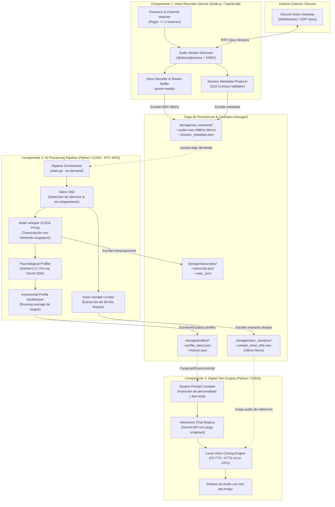

# Discord AI Profiler & Digital Twin 🧠🎙️

Sistema autónomo de captura de audio en Discord, perfilado psicológico/conductual con IA y creación de gemelos digitales conversacionales (Chatbot réplica + Clonación de voz) optimizado para **NVIDIA GeForce RTX 4070 (12 GB VRAM)** y calibrado para español de Uruguay / Rioplatense.

---

## 🏗️ Diagrama de Componentes y Relaciones

El sistema está diseñado bajo el principio de **desacoplamiento estricto** (*Decoupled Pipeline*): la captura de audio en vivo y el procesamiento intensivo con IA son subsistemas completamente independientes que se comunican exclusivamente a través de contratos de datos versionados e inmutables en disco (`storage/`).



---

## 🔄 Relación y Flujo entre Componentes

| Origen | Destino | Tipo de Interacción | Descripción |
| :--- | :--- | :--- | :--- |
| **Discord Gateway** | **Voice Recorder (Node.js)** | Red / UDP | Transmite los paquetes Opus etiquetados por usuario vía SSRC. |
| **Voice Recorder** | **Storage (`raw_sessions/`)** | I/O Disco | Escribe los archivos WAV independientes por usuario y el archivo `session_metadata.json`. |
| **Storage (`raw_sessions/`)** | **AI Pipeline (Python)** | I/O Disco | El usuario ejecuta el pipeline cuando desea procesar una llamada grabada. |
| **AI Pipeline (VAD)** | **Storage (`clean_samples/`)** | I/O Disco | Aísla los mejores segmentos de audio de cada hablante sin pisadas de fondo. |
| **AI Pipeline (STT)** | **Storage (`transcripts/`)** | I/O Disco | Genera el diálogo ordenado y sincronizado con marcas de tiempo. |
| **AI Pipeline (Profiler)** | **Storage (`profiles/`)** | I/O Disco | Actualiza incrementalmente el dossier psicológico (`profile_latest.json`). |
| **Storage (`profiles/` + `clean_samples/`)** | **Digital Twin Engine** | Inferencia / GPU | Combina el prompt de personalidad con la muestra de voz para chatear y hablar como el amigo. |

---

## 📁 Estructura del Monorepo

```text
.
├── docs/                           # Documentación de ingeniería y arquitectura
│   ├── adr/                        # Architecture Decision Records (ADR-001, etc.)
│   ├── specs/                      # Esquemas JSON formales (Draft-07)
│   └── guides/                     # Guías operativas de configuración
├── services/
│   ├── voice-recorder/             # [Componente 1] Bot grabador autónomo (Node.js/TS)
│   │   ├── src/                    # Listeners, audio pipeline y contratos Zod
│   │   ├── package.json
│   │   └── tsconfig.json
│   └── ai-pipeline/                # [Componente 2 y 3] Pipeline de IA y Gemelo (Python/CUDA)
│       ├── core/                   # STT, VAD, Profiler, TTS, contratos Pydantic
│       ├── tests/                  # Pruebas automatizadas de contratos y lógica
│       ├── requirements.txt
│       └── main.py
├── storage/                        # Almacenamiento local (Ignorado en Git)
│   ├── raw_sessions/               # Audios por sesión: YYYY-MM-DD_HH-mm-ss/
│   ├── clean_samples/              # Muestras de voz limpias para clonación
│   ├── transcripts/                # Transcripciones estructuradas en JSON
│   └── profiles/                   # Dossiers de personalidad por usuario
└── config/                         # Configuraciones generales
```

---

## 🚦 Roadmap del Proyecto

* [ ] **Fase 0: Fundación y Contratos de Datos** 👈 *(En progreso)*
* [ ] **Fase 1: Módulo Grabador Autónomo (Node.js)**
* [ ] **Fase 2: Pipeline de Transcripción y Curación de Voz (Python / CUDA)**
* [ ] **Fase 3: Motor de Perfilado Psicológico y Conductual (Gemini)**
* [ ] **Fase 4: Gemelo Digital Conversacional (Chatbot réplica)**
* [ ] **Fase 5: Módulo de Clonación de Voz Local (TTS en RTX 4070)**
* [ ] **Fase 6: Orquestador y Experiencia Unificada**
