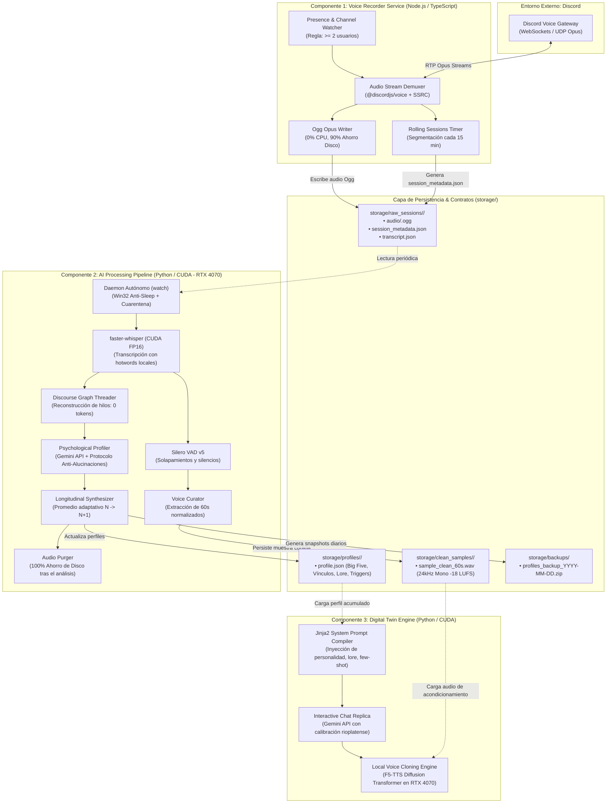

# Discord AI Profiler & Digital Twin 🧠🎙️

[](https://github.com/Saframa/Analizador-de-personalidad-discord)
[](https://www.python.org/)
[](https://nodejs.org/)
[-76B900)](https://www.nvidia.com/)
[](LICENSE)

Sistema autónomo de captura de audio en Discord, perfilado psicológico/conductual con IA y creación de gemelos digitales conversacionales (Chatbot réplica + Clonación de voz neuronal local) optimizado para **NVIDIA GeForce RTX 4070 (12 GB VRAM)** y calibrado específicamente para el sociolecto uruguayo y rioplatense.

---

## 🏗️ Arquitectura Desacoplada Monorepo

El sistema está diseñado bajo el principio de **desacoplamiento estricto** (*Contract-First Architecture*): la captura de audio en tiempo real y el procesamiento intensivo con IA son subsistemas independientes que se comunican exclusivamente a través de contratos de datos formales JSON Schema Draft-07 en [`docs/specs/`](docs/specs/).



---

## ⚡ Capacidades Principales

1. **Grabación Continua en Intervalos de 15 Minutos (*Rolling Sessions*):**
   * El bot rota sesiones automáticamente cada 15 minutos sin abandonar el canal de voz.
   * Si una llamada dura 8 horas, genera 32 bloques independientes. Si ocurre un corte de luz en la hora 7:50, solo se pierden los últimos minutos y el resto queda procesado y a salvo.
2. **Monitoreo Longitudinal Multidimensional (> 1 Mes de Llamadas):**
   * **Big Five (OCEAN):** Apertura, Responsabilidad, Extraversión, Amabilidad, Neuroticismo con citas textuales obligatorias (protocolo anti-alucinaciones).
   * **Matriz de Afinidad y Grafo Social (`SocialDynamics`):** A quién responde más, amigos más cercanos y a quién le dirige chicanas/bromas.
   * **Lore Grupal y Memoria Episódica (`GroupLore`):** *Inside jokes*, frases meme, entidades externas (juegos, proyectos) y anécdotas compartidas.
   * **Disparadores Emocionales (`EmotionalTriggers`):** *Tilts* (frustraciones/quejas) vs *Hiperfocos* (temas donde habla con pasión).
   * **Iniciativa y Rol Operativo (`ActivityInitiative`):** Si es iniciador o seguidor de planes, y qué juegos suele proponer.
   * **Cronotipo (`TemporalPatterns`):** Distribución horaria (noctámbulo, vespertino, madrugador) y variaciones de tono en la madrugada.
3. **Comprensión de Contexto Conversacional Zero-Tokens (`DiscourseThreader`):**
   * Conecta qué amigo le responde a quién y reconstruye árboles de respuesta jerárquicos utilizando grafos de discurso y similitud léxica sin consumir tokens de Gemini.
4. **Gemelo Digital Interactivo con Clonación de Voz Local (TTS):**
   * Chat en tiempo real que adopta el rol, humor, jerga uruguaya y cadencia exacta del amigo.
   * Síntesis de voz en $\sim 1.5$ segundos en la **NVIDIA RTX 4070 (12 GB)** utilizando modelos de difusión neuronal (**F5-TTS**) condicionados con la muestra limpia de 60 segundos del usuario.
5. **Resiliencia Industrial y Operación Desatendida:**
   * **Win32 Anti-Sleep API:** Evita la suspensión de Windows durante el procesamiento nocturno.
   * **Cola de Cuarentena (`.failed`):** Archivos corruptos se aíslan sin detener el bucle.
   * **Purga Automática de Disco:** Elimina los audios pesados tras el análisis, conservando la transcripción y las muestras de 60s (~2.8 MB por amigo de por vida).
   * **Backups Diarios:** Snapshots `.zip` automáticos con retención de 30 días.
   * **Logging Rotativo:** Historial persistente en `storage/logs/pipeline.log` (10 MB x 5 copias).

---

## 📋 Requisitos Previos

* **Sistema Operativo:** Windows 10/11 (probado nativamente) o Linux.
* **GPU:** NVIDIA GeForce RTX 3060 / 4060 / 4070 / 4080 / 4090 con soporte CUDA 12 y $\ge 8$ GB VRAM (recomendado 12 GB).
* **Software:**
  * **Node.js:** Versión $\ge 18.0.0$ (recomendado 20+ LTS).
  * **Python:** Versión $\ge 3.10$ y $\le 3.13$ (probado en Python 3.13 con soporte PyTorch CUDA).
  * **FFmpeg:** Instalado y accesible en el `PATH` del sistema.
* **Cuentas y Claves:**
  * Token de Bot de Discord con permisos de Voz y los siguientes Gateway Intents: `Guilds`, `GuildVoiceStates`, `GuildMembers`.
  * Clave de API de Google GenAI (`GEMINI_API_KEY`).

---

## 🚀 Instalación y Configuración Paso a Paso

### 1. Clonar el Repositorio
```bash
git clone https://github.com/Saframa/Analizador-de-personalidad-discord.git
cd Analizador-de-personalidad-discord
```

### 2. Configurar el Grabador de Voz (Node.js)
```bash
cd services/voice-recorder
npm install
npm run build
cp .env.example .env
```
Edita `services/voice-recorder/.env`:
```env
DISCORD_TOKEN=tu_token_de_discord_aqui
MIN_USERS_TO_RECORD=2
DEBOUNCE_LEAVE_SECONDS=30
ROTATION_INTERVAL_MINUTES=15
STORAGE_DIR=../../storage
```

### 3. Configurar el Pipeline de IA (Python)
```bash
cd ../ai-pipeline
python -m venv .venv
# En Windows PowerShell:
.venv\Scripts\Activate.ps1
# En Linux/macOS:
# source .venv/bin/activate

pip install -r requirements.txt
cp .env.example .env
```
Edita `services/ai-pipeline/.env`:
```env
GEMINI_API_KEY=tu_gemini_api_key_aqui
GEMINI_MODEL=gemini-flash-latest
STORAGE_DIR=../../storage
```

---

## 🏃 Modo de Operación Recomendado (24/7 Autónomo)

Para dejar el sistema recolectando y analizando llamadas de forma continua durante meses sin intervención manual, abre dos terminales de PowerShell:

**Terminal 1 — Grabador de Discord:**
```powershell
cd services/voice-recorder
npm run start
```
*El bot vigilará los canales de voz, se conectará cuando haya $\ge 2$ amigos y grabará en bloques rotativos de 15 minutos.*

**Terminal 2 — Vigilante de IA en Segundo Plano:**
```powershell
cd services/ai-pipeline
python main.py watch --interval 15
```
*Detectará cada bloque nuevo de 15 minutos, lo transcribirá con Whisper en la RTX 4070, aislará la voz limpia, actualizará el perfil psicológico y multidimensional con Gemini, eliminará el audio pesado y mantendrá Windows despierto para procesar de noche.*

---

## 🛠️ Referencia Completa de Comandos CLI

El script `main.py` en `services/ai-pipeline/` ofrece herramientas completas de administración:

### Gestión de Usuarios (`main.py user`)
```bash
# Listar amigos registrados y estado de sus muestras de voz
python main.py user list

# Registrar un nuevo amigo con apodos y notas personales
python main.py user create --user-id 438796478035787780 --username saframa --display-name Marce --nicknames "marce,safra" --notes "creador del proyecto, pide ideas web"

# Ver la ficha técnica y psicológica multidimensional completa
python main.py user show --user-id saframa

# Actualizar apodos o agregar nuevas notas
python main.py user update --user-id saframa --add-notes "juega LoL los fines de semana"
```

### Gemelo Digital y Chat Réplica (`main.py chat`)
```bash
# Chat conversacional de texto con el gemelo de un amigo
python main.py chat --user-id saframa

# Chat interactivo con respuestas habladas por voz clonada (F5-TTS)
python main.py chat --user-id saframa --voice --play

# Pregunta directa no interactiva
python main.py chat --user-id saframa --prompt "¿Qué hacés bo? ¿Sale jugar a algo?"
```

### Síntesis de Voz Standalone (`main.py tts`)
```bash
# Sintetizar cualquier texto arbitrario con la voz clonada de un amigo
python main.py tts --user-id saframa --text "Bo, mirá que el sistema quedó flama de verdad." --play
```

### Procesamiento y Perfilado Manual
```bash
# Procesar manualmente una sesión específica (STT + Silero VAD + Muestras 60s)
python main.py process --session 2026-09-25_00-00-18

# Ejecutar el perfilado psicológico sobre una sesión transcripta
python main.py profile --session 2026-09-25_00-00-18

# Ver los hilos de conversación y quién le responde a quién (0 tokens)
python main.py context --session 2026-09-25_00-00-18
```

---

## 🧪 Ejecución de Pruebas Automatizadas

El proyecto cuenta con **52 pruebas automatizadas** que garantizan la integridad de los contratos de datos, el procesamiento de audio, la lógica de grafos y la compilación del gemelo digital.

```bash
# Ejecutar suite de Python (49 pruebas)
cd services/ai-pipeline
python -m pytest tests/ -v

# Ejecutar suite de Node.js (3 pruebas)
cd ../voice-recorder
npm test
```

---

## 📚 Documentación Adicional

* [Guía de Arquitectura, Operaciones y Referencia Técnica](docs/guides/architecture_and_operations.md)
* [ADR-001: Arquitectura Desacoplada y Contratos de Datos](docs/adr/ADR-001-decoupled-data-contracts.md)
* [Contrato A: Esquema de Metadata de Sesión](docs/specs/session_metadata.schema.json)
* [Contrato B: Esquema de Transcripción](docs/specs/transcript.schema.json)
* [Contrato C: Esquema de Perfil de Usuario Multidimensional](docs/specs/user_profile.schema.json)

---

## 📄 Licencia

Este proyecto está bajo la licencia MIT. Consulta el archivo `LICENSE` para más detalles.
