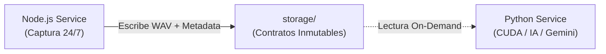

# ADR-001: Pipeline Desacoplado Basado en Contratos de Datos en Disco

## Estado
**Aceptado**

## Fecha
2026-09-24

## Contexto y Problema
El sistema *Discord AI Profiler & Digital Twin* requiere dos tipos de procesamiento con características operativas radicalmente opuestas:
1. **Captura y Demultiplexación de Voz en Vivo:** Debe operar de forma continua, en tiempo real, con baja latencia y consumo de recursos prácticamente nulo (<1% CPU, 0% GPU) para no interferir con las actividades del usuario en su PC.
2. **Procesamiento de IA y Clonación de Voz:** Requiere inferencia intensiva acelerada por GPU (CUDA en NVIDIA RTX 4070), grandes modelos de lenguaje (Gemini API) y modelos de síntesis acústica (`faster-whisper`, `F5-TTS`/`XTTS-v2`). Esta etapa se dispara bajo demanda (*on-demand*) por decisión del usuario.

Si ambos subsistemas se ejecutaran en el mismo proceso (por ejemplo, un único script de Python con `discord.py` y PyTorch):
* Un error de inferencia o desbordamiento de memoria GPU (CUDA OOM) tiraría abajo el socket del bot de Discord y corrompería las grabaciones en curso.
* El soporte para *recibir* audio multiplexado de múltiples usuarios en `discord.py` en Windows es inestable y depende de extensiones no oficiales con enlaces C++ delicados.
* Node.js con `@discordjs/voice` es el estándar de la industria más robusto y probado para la ingesta de paquetes Opus por SSRC sin pérdidas.

## Decisión de Arquitectura
Adoptamos una **Arquitectura Híbrida Desacoplada (Decoupled Pipeline)**:
1. **Servicio de Captura (`services/voice-recorder`):** Desarrollado en **Node.js / TypeScript**, responsable exclusivamente de escuchar Discord, separar canales por usuario y volcar el audio y los metadatos al almacenamiento local.
2. **Servicio de IA (`services/ai-pipeline`):** Desarrollado en **Python**, responsable de la transcripción, VAD, perfilado psicológico con Gemini y síntesis de voz en la RTX 4070.
3. **Frontera de Comunicación Inmutable:** La comunicación entre ambos módulos se realiza exclusivamente a través del sistema de archivos local (`storage/`) mediante **Contratos de Datos rígidos y versionados** (archivos de audio WAV 48kHz + esquemas JSON Draft-07).

## Consecuencias y Beneficios

### Positivas:
* **Aislamiento de fallos:** Un fallo en el pipeline de IA nunca detiene la grabación de una llamada de Discord en curso.
* **Idempotencia y Reproducibilidad:** Dado que las sesiones se persisten inmutables en disco, es posible re-ejecutar el análisis de IA con diferentes hiperparámetros o modelos de LLM sin necesitar que los usuarios vuelvan a hablar.
* **Máximo aprovechamiento de hardware:** La RTX 4070 permanece al 0% de uso mientras se graba; la GPU solo se activa cuando el usuario dispara el procesamiento.
* **Validación estricta:** Ambos servicios validan de forma independiente los datos entrantes y salientes (Zod en TypeScript y Pydantic en Python).

### Negativas / Compromisos:
* Requiere mantener dos entornos de desarrollo en la máquina local (Node.js/npm y Python/pip).
* Requiere sincronizar manualmente las definiciones de esquemas entre Zod y Pydantic (garantizado mediante los JSON Schemas en `docs/specs/` y tests automatizados).
